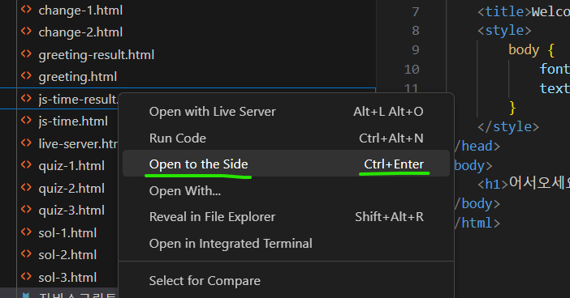
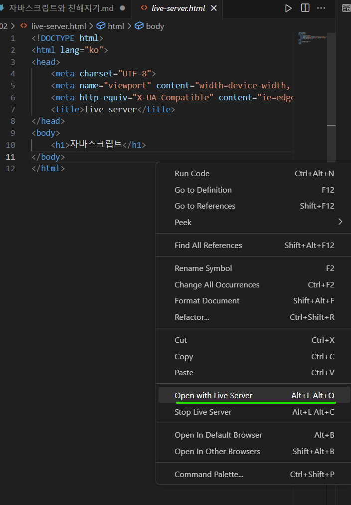
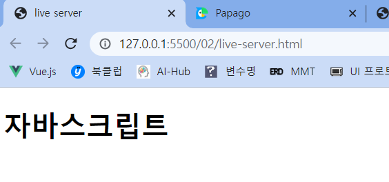
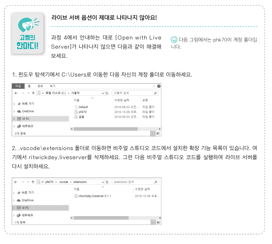
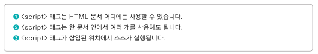
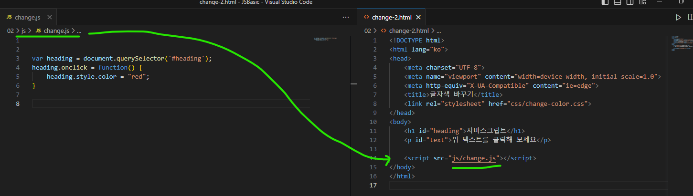

### 02-1 개발 환경 준비
- 크롬 브라우저
- 비주얼 스튜디오 코드

### 02-2 비주얼 스튜디오 코드와 인사
- 작업 폴더 설정, 파일 열기
- 나란히 같이 보고 싶을 때 
- 확장 기능 Live Server
  - 수정한 소스를 웹 브라우저에서 바로 확인 가능
  - 실행하고싶은 html 파일 위에서 우클릭 
  - 127.0.0.1 : 라이브 서버 확장 기능이 가상으로 만든 서버 주소
  - 소스코드를 수정하고 저장하기만 해도 바로 반영
  - 잘 안될 때 참고하기 

### 02-3 자바스크립트 소스 작성, 실행
- HTML문서 안에 작성 vs 외부 스크립트 파일 연결
- HTML문서 안에 작성
  - \
  - 보통은 HTML 문서 내용이 끝나는 </body> 태그 앞에 삽입
- 외부 스크립트 파일 연결
  - 이유 : 수정 용이. 프로젝트가 커질수록 필요해져
  - js 파일 따로 만들고, HTML 파일에  

### 02-4 자바스크립트 프로그램
### 02-5 입력과 출력
### 02-6 규칙

