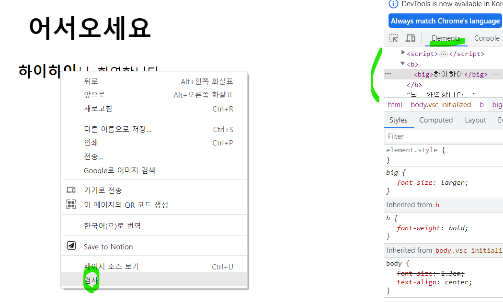
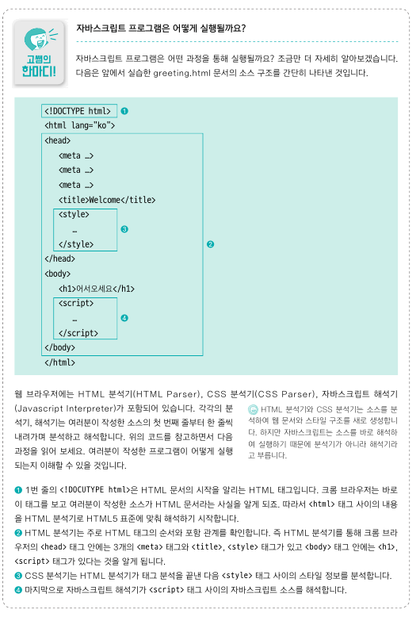
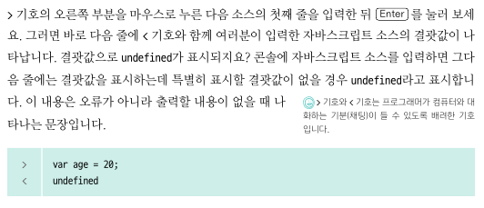
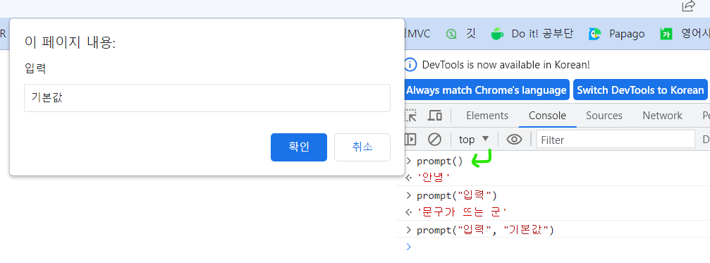
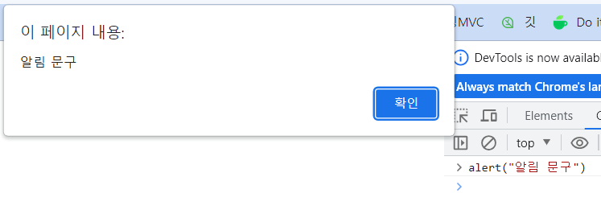
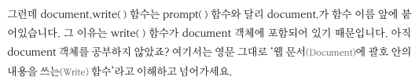
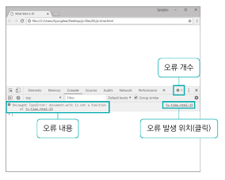
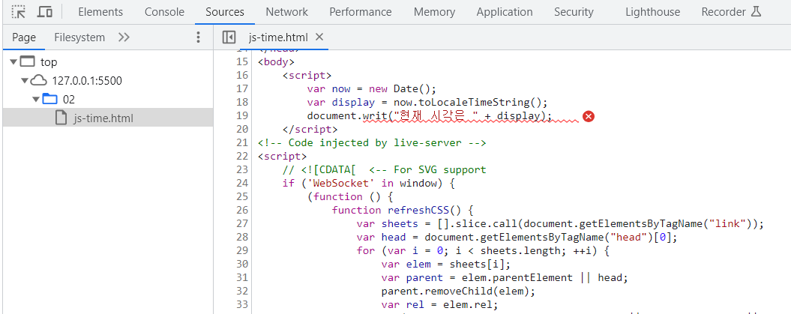

 

### 02-1 개발 환경 준비
- 크롬 브라우저
- 비주얼 스튜디오 코드

 
 

### 02-2 비주얼 스튜디오 코드와 인사
- 작업 폴더 설정, 파일 열기
- 나란히 같이 보고 싶을 때 
- 확장 기능 Live Server
  - 수정한 소스를 웹 브라우저에서 바로 확인 가능
  - 실행하고싶은 html 파일 위에서 우클릭 
  - 127.0.0.1 : 라이브 서버 확장 기능이 가상으로 만든 서버 주소
  - 소스코드를 수정하고 저장하기만 해도 바로 반영
  - 잘 안될 때 참고하기 

 
 

### 02-3 자바스크립트 소스 작성, 실행
- HTML문서 안에 작성 vs 외부 스크립트 파일 연결
- HTML문서 안에 작성
  - \
  - 보통은 HTML 문서 내용이 끝나는 </body> 태그 앞에 삽입
- 외부 스크립트 파일 연결
  - 이유 : 수정 용이. 프로젝트가 커질수록 필요해져
  - js 파일 따로 만들고, HTML 파일에 \ 

 
 

### 02-4 자바스크립트 프로그램
- 크롬 프라우저에서 프로그램 소스 확인하기 : 우클릭 -> 검사 
- 자바 스크립트 실행 과정

 
 

### 02-5 입력과 출력
- 크롬 브라우저의 콘솔 도구
  - 자바스크립트 소스를 간편하게 연습해 볼 수 있음
  - 주소창에 about:blank 치고 콘솔창(컨트롤+시프트+J.맥은 커맨드+옵션+J) 열기
  - 
- 사용자 입력값 받기 -- **prompt() 함수**
  - 
- 알림 창으로 출력하기 -- **alert() 함수**
  - 
- 웹 브라우저 화면에서 출력하기 -- **document.write() 함수**
  - var name = prompt("이름을 입력하세요.");
		document.write( name + "님, 환영합니다.")
  - 
- 콘솔에 출력하기 -- **console.log() 함수**
  - var name = prompt("이름을 입력하세요.");
		console.log( name + "님, 환영합니다.")
- 콘솔로 오류 찾아내기
  - 
  - 클릭하면, 오류 위치 확인 가능 

 
 

### 02-6 규칙 6가지
- 자바스크립트는 대소문자 구분함
- 가독성을 위해 들여 쓰기 사용하기
  - 자바스크립트 해석기는 들여쓰기 신경쓰진 않지만 프로그래머를 위해서는 신경 쓰자
- 세미콜론으로 문장 구분
  - 세미콜론 없어도 잘 실행되긴 하지만, 만에 하나의 상황을 위해
- 주석 처리
  - 한 줄 주석 //
  - 여러 줄 주석 /*    */
- 식별자는 정해진 규칙을 지켜 작성하기
  - 식별자 Identifier
  - 첫 글자는 영문, 밑줄(_), 달러기호($). 즉 다른 특수기호나 숫자 사용 x
  - 공백x. 필요하면 하이픈(-)이나 밑줄(_)로 연결
  - 아니면 첫 단어는 소문자로 시작, 중간 단어는 대문자로 시작
- 예약어는 식별자로 사용 불가

