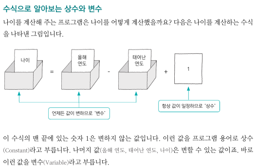
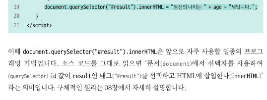
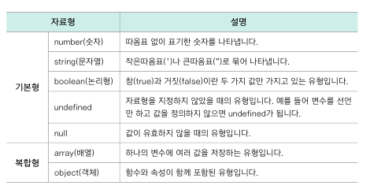
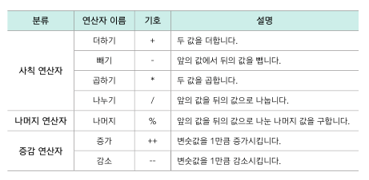
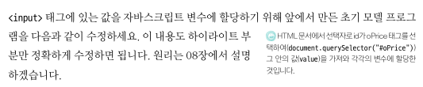
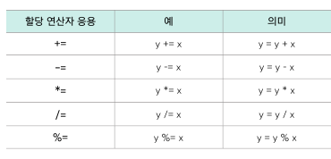
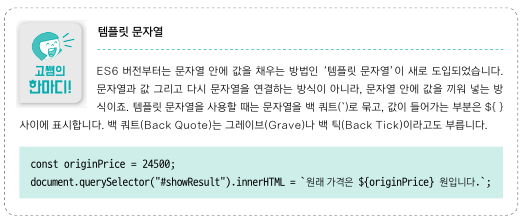
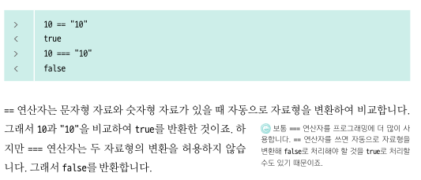
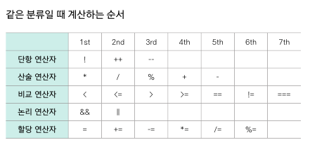

<br/>

### 03-1 변수란?
- 변하는 값을 저장할 때 사용
- 변수 선언 규칙
  - 의미 있게 짓기
  - 카멜 케이스 사용
  - 첫 글자는 문자나 밑줄(_), 달러기호($)
- 변수에 값이나 식 저장
  - = : 할당 연산자
  - 변수를 선언하면서 저장 `var apple = "Yummy";`
  - 변수를 선언한 다음 저장
    ```
    var banana;
    banana = "long and yummy";
    ```
- 실습 : 나이 계산하기
  - age.html
  - 입력 : 올해 연도, 태어난 연도
  - 반환 : 나이
  - 
- let으로 선언 : 블록({}으로 묶은 범위)을 벗어나면 사용 불가
- const으로 선언 : 상숫값 선언

<br/>
<br/>

### 03-2 자료형
- 실무에서는 데이터 타입, 데이터형, 데이터 유형 등으로 부름
- 종류
  - 
- 자료형 확인 -- ** typeof **
- 숫자형
  - 정수
  - 실수
    - 0.1 + 0.2 ≠ 0.3
    - 컴퓨터가 실수를 이진수로 이해하는 과정에서 근사값을 취하기 때문에 오차 있음
- 문자형
  - 작은 따옴표, 큰 따옴표
- 논리형
  - true, false
- undefined
  - 변수를 선언하고 값을 할당하지 않은 상태
  - 아직 자료형이 정의되지 않았을 때의 상태
    - 자바스크립트는 (변수가 선언될 때 x) 값이 할당될 때 o 자료형 정해짐
  - 다음 경우에 undefined 반환
    - 값을 할당하지 않은 변수
    - 메서드와 선언에서 변수가 할당받지 않는 경우
    - 함수가 값을 return하지 않았을 때
- null
  - 변수를 선언하고 빈 값을 할당한 상태 (빈 객체)
  - 처음에 할당된 값이 더는 유효하지 않음
  - 변수를 초기화 할 때 null을 사용
- undefined == null (true)
- 배열
  - 대괄호 [ , , ]
  - 배열[인덱스]로 해당 위치의 값 추출 가능
- 객체
  - 중괄호 { 키 : 밸류, 키 : 밸류, ... , 키 : 밸류}
- 자바스크립트 자료형의 특징
  - C 언어, 자바 : 변수를 선언할 때 자료형 지정, 그 자료형에 맞는 값만 변수에 저장 가능
    - 강력한 자료형 체크 Strong Data Type Check
  - 자바스크립트 : 느슨한 자료형 체크  Weak Data Type Check
  - cf. 타입스크립트 : 자바스크립트 + Strong Type

<br/>
<br/>

### 03-3 연산자
- 기초 산술 연산자
  
- 실습 : 할인 가격 계산하기
  - bargain.html
  - 

<br/>
<br/>

### 03-4 연산자 깊게 알아보기
- 할당 연산자 응용 
- 더하기 연산자 vs 연결 연산자
  - 문자열에서 "+"는 연결 연산자
- 템플릿 문자열
  - \`(백틱)이 안에 ${name} 포매팅 처럼 사용`
  
- 문자형과 숫자형의 연산
  -  \+ : 문자형 취급. 연결 연산자
  - -, *, /, % : 숫자형 취급. 산술 연산자
- 비교 연산자
  - ==, !=, <, <=, >, >=, ===
  - == 와 === 의 차이
    - 문자형 == 숫자형 : 자동으로 형변환해서 비교
    - 문자형 === 숫자형 : 두 자료형의 변환 허용 x 
    - 
  - 문자끼리 비교는 아스키값을 이용
    - 예) A의 아스키값 65 < a의 아스키값 97 (true)
- 논리 연산자
  - 부울 연산자, 불리언 연산자
  - or : ||
  - and : &&
  - not : !
- 연산자 우선순위
  - 단항 -> 산술 -> 비교 -> 논리 -> 할당
  - 


<br/>
<br/>

