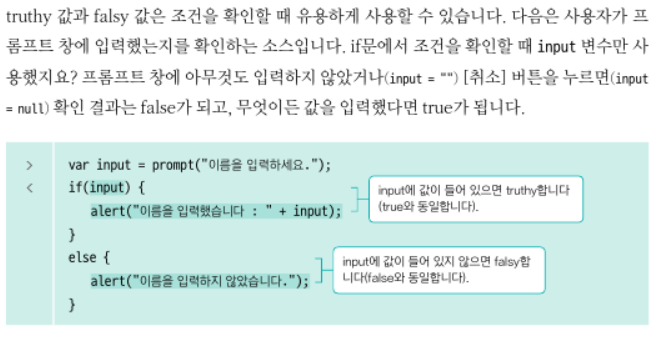
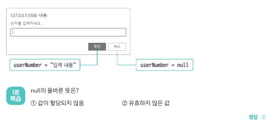
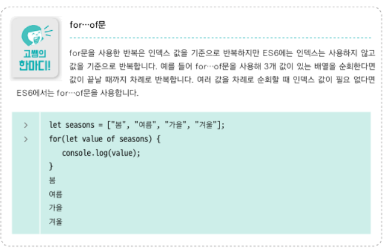

<br/>

### 04-1 조건에 따라 흐름 조절 : if else문
```
if(조건식){ 
    참일 경우 실행문장
}
else {
    거짓일 경우 실행문장
};
```
- 조건 연산자 (자바의 삼항연산자와 같음)
```
조건식 ? 참일 경우 실행 : 거짓일 경우 실행; 
```
- truthy, falsy
  - truthy : true로 인정할 수 있는 값
    - falsy값을 제외한 나머지
  - falsy : false로 인정할 수 있는 값
    - 0
    - ""(빈 문자열)
    - NaN (숫자가 아님(Not a Number)) : 보통 변수를 선언만 하고 값을 할당하지 않은 상태에서 연산을 하면 볼 수 있음
    - undefined
    - null 
  - 조건 확인할 때 유용
    - falsy : 아무것도 입력하지 않았을 때 "", 취소했을 때 null 모두 false로 인정 
- 실습 : 3의 배수 검사기
  - 취소를 누르면 prompt값에 null이 들어감
- TIP : true가 될 경우가 많은 조건을 if문에 넣고 다른 조건을 else에서 처리
  - if문 조건이 true가 되면 그 다음에 오는 else문은 실행하지 않고 넘어가기 때문에
  - userNumber == null(취소버튼 누를 경우)보다는
   userNumber != null(값을 입력했을 경우)을 if 조건으로

<br/>
<br/>

### 04-2 조건이 많을 때 흐름 조절 : switch문
```
switch(식){
    case 값1 :
        실행문장;
        break;
    case 값2 :
        실행문장;
        break;
    ...
    default :
        값이 전부 일치하지 않을 때 실행

};
```

<br/>
<br/>

### 04-3 명령 반복 실행 : for문
```
for (카운터변수 선언, 초기화 ; 조건식 ; 카운터변수 조절){
    실행문장
};
for (var i=0 ; i<10 ; i++){
    실행문장
};

// for of 문
for 변수 of 배열{
    배열을 순회하며 변수에 값이 담김
};
```
- 카운터 변수 : for문을 실행할 때 반복 횟수의 기준이 되는 변수
- for of 문 (ES6)


<br/>
<br/>

### 04-4 for문 반복 : 중첩for문
- 실습 : 구구단

<br/>
<br/>

### 04-5 특정 조건에 따라 반복 : while, do while문
```
while (조건식){
    실행문장
};

//do while
do {
    실행문장
}while(조건식);
```
- 실습 : 팩토리얼 계산기

<br/>

- 어떤 반복문을 사용해야 할까?
  - 초깃값이 있으면서 일정한 간격으로 반복할 때 => for
  - 반복 간격 없이 조건을 만족하는 동안 => while
  - 일단 명령을 실행한 후 상황에 따라 반복할지 말지 정할 때 => do while

<br/>
<br/>

### 04-6 반복 멈추기, 건너뛰기 :  break, continue
- 반복 멈추기 : break
- 반복 건너뛰고 반복문의 맨 앞으로 되돌아가기 : continue
- 실습 : 짝수만 더하는 프로그램
  - for문 안에서 조건식이면 if else를 if continue로 쓸 수 있어.

<br/>
<br/>