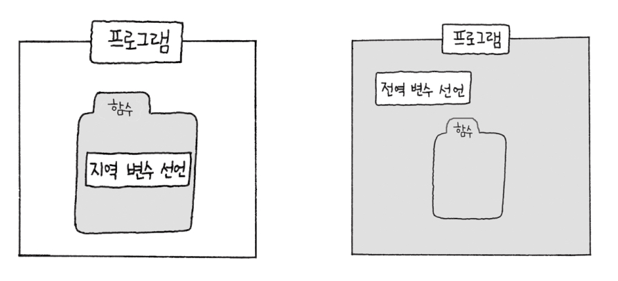
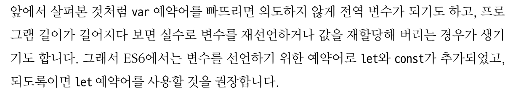
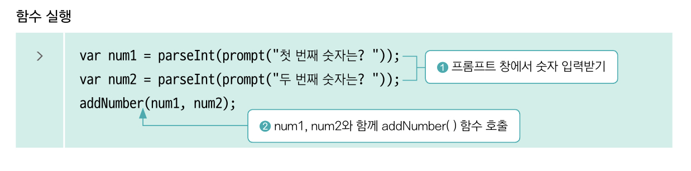
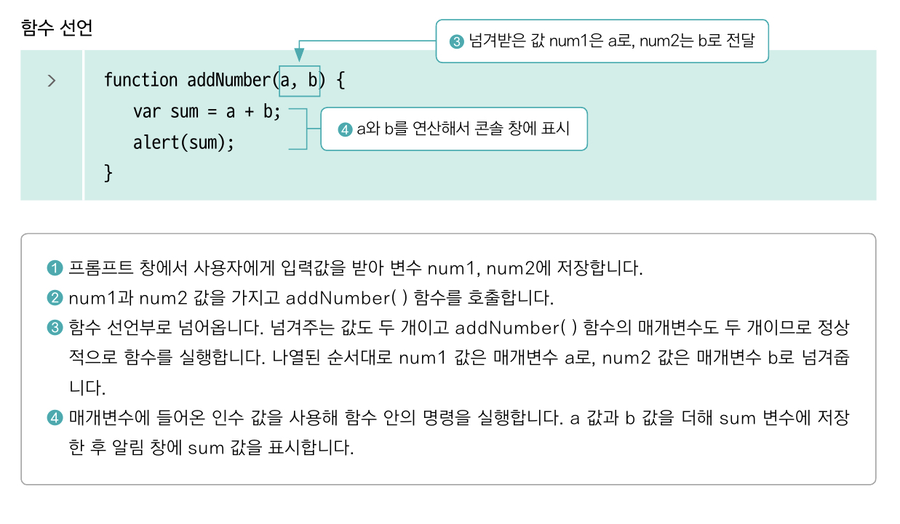
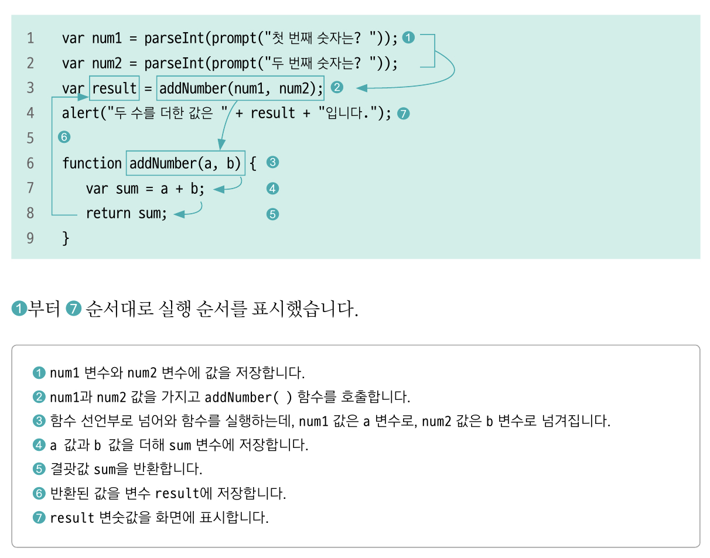
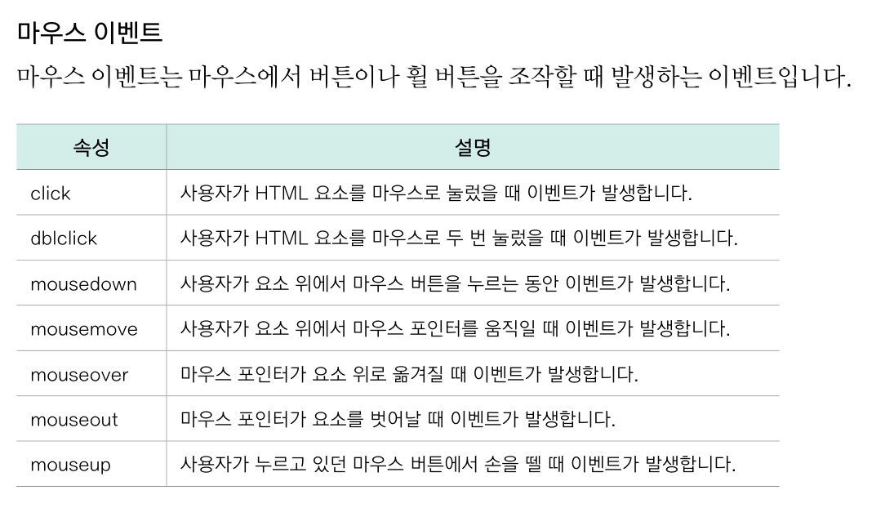
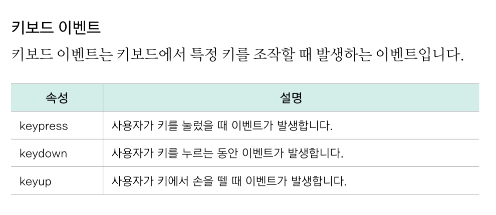
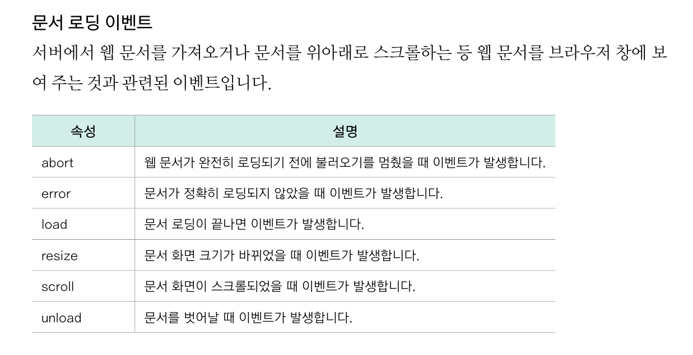
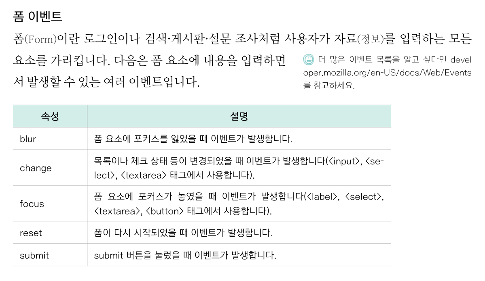

<br/>

### 5-1 여러 동작을 묶은 덩어리, 함수
- 왜 사용?
  - 함수를 사용하면 각 명령의 시작과 끝을 명확하게 구별할 수 있음
  - 별도의 이름을 붙이면 같은 기능이 필요할 때마다 해당 함수 사용 가능
- 함수 선언 : 함수가 어떤 명령을 처리해야 할지 미리 알려주는 것
- 함수 실행 = 함수를 호출한다. : 선언한 함수를 가져와 사용하는 것
```
function 함수이름(매개변수){
    실행문장;
}
```
- 함수 선언의 위치는 프로그램 흐름에 영향 x. 그래서 보통 소스의 앞/뒷부분에 모아둠
- 실습 : 버튼으로 함수 실행
  - 원하는 버튼에 onclick()="함수이름" 속성 추가
  - onclick : 버튼을 눌렀을 때 실행할 대상인 함수를 알려 주는 예약어


<br/>
<br/>

### 5-2 let과 constant로 변수 선언하기
- ES6 버전에서 생긴 예약어
- 변수의 적용 범위 (스코프(Scope))
  - 지역변수, 로컬 변수
    - 함수 안에서 선언, 함수 안에서만 사용
    - `var 변수이름=값;`
    - var 없으면 함수 안에서 선언했어도 **전역 변수**로 취급
    - 지역변수와 전역변수 이름 같더라도 지역변수는 전역변수에 영향 주지 않지만, 나중에 헷갈릴 수 있으니 되도록 겹치지 않게 하자
  - 전역변수, 글로벌 변수
    - 스크립트 소스 전체에서 사용
    - 함수 안에서 전역 변수 선언하려면 var 사용x
  - A 함수의 결과값을 다른 함수에서도 실행할 수 있게 하려면 => 전역 변수
- var을 사용한 변수의 특징
  - 호이스팅 hoisting (끌어올리다): 선언 부분을 스코프의 가장 위쪽으로 끌어올리는 것
    - 상황에 따라 변수 선언과 할당을 분리
    - 실제로 끌어올리는 것 x. 소스를 그런 식으로 해석한다는 것
    - 예) 선언 전에 사용하려고 하면 에러가 나는 게 아니라 undefined
    - 자바스크립트 해석기가 var 변수를 따로 기억해 둬서 마치 선언한 것과 같은 효과 (그래서 예상치 못한 결과 나올수도 있어)
  - 재선언이 가능
    - 이전의 변수를 덮어쓰기 때문에 여러 사람의 코드가 합쳐질 때 예상치 못한 결과 나올 수 있음


- var와 let, const 차이 : 스코프의 범위
  - var : 함수 영역(레벨)의 스코프를 가짐
  - let, const : 블록 영역의 스코프를 가짐
- let
  - 블록( { } ) 안에서만 쓸 수 있음
    - 블록변수라서 sum이 정의되지 않았다는 오류
    - for문의 카운터 변수 let으로 선언
  - 재할당은 가능하지만 재선언은 할 수 없음
  - 호이스팅이 없음
    - 변수y를 초기화하기 전에 사용할 수 없다는 오류
- const
  - 상수(프로그램 안에서 변하지 않는 값)를 선언할 때 사용
  - 블록 레벨의 스코프
  - 재선언x , 재할당 x
- 자바스크립트 스타일 가이드
  - 전역 변수는 최소한으로
  - var변수는 함수의 시작 부분에 선언
  - for문에서 카운터 변수를 사용할 때는 블록 변수 사용
(아얘 for문 밖에서 var로 선언하거나)
  - ES6 사용한다면, var보다는 let 사용하기

<br/>
<br/>

### 5-3 여러 번 사용할 수 있는 함수 만들기
- 매개변수 Parameter (인자)
```
function 함수이름(매개변수, 매개변수){
    매개변수를 사용한 실행문장;
}
```
- 인수 Argument (전달인자)
  - 함수를 실행할 때 매개변수에 할당값을 넣어 넘겨주는 값
  - `함수(인수, 인수)`
- 함수 동작 과정
  -   
- 기본 값 지정하기
  - 매개변수=기본값
  - 05.html에서 실습
- return문
  - return 함수값을 반환한다.
  - 반환 위치 : 함수를 호출한 위치
  - 과정 

<br/>
<br/>

### 5-4 함수 표현식
- '함수 선언 & 함수이름 사용'이 아닌 다른 방법들 있음 => 함수 표현식
- 익명함수
  - 이름이 없는 함수
  - 함수 자체가 식(Expression)
    - 변수에 할당 가능 : 변수이름을 함수이름처럼 사용 가능
    - 다른 함수의 매개변수로 사용 가능
```
var 변수 = function(매개변수){
    함수 실행문장;
}
// 함수 실행
변수(매개변수)
```
- 즉시 실행 함수
  - 함수를 정의함과 동시에 실행
  - 함수 선언 소스 전체를 괄호로 묶고, 괄호 앞(혹은 뒤)에 인수가 들어갈 괄호
  - 즉시 실행 함수는 식이기 때문에 세미콜론(;) 붙이기
  - 변수에 할당 가능
```
(function(매개변수, 매개변수){
        실행문장;
})(인수, 인수); // 괄호 뒤

(function(매개변수, 매개변수){
        실행문장;
}(인수, 인수)); // 괄호 앞
```
- 화살표 함수
  - ES6부터 가능
  - => 표기법 (화살표 표기법)
  - 익명 함수에서만 사용 가능
  - 매개변수가 없을 때 : funtion 생략, =>로 실행문장 표시
    ```
    () => { 실행문장 };
        
        // 한 줄은 중괄호, return도 생략 가능
        () => 리턴값 ;
    ```
  - 매개변수가 1개일 때 : function 생략, 매개변수의 괄호 생략 (약간 input => output 이라 생각하면 쉬운 듯?!)
    ```
    매개변수 => 리턴값 ;
    ```
  - 매개변수가 2개 이상일 때
    ```
    (매개변수) => { 실행문장 } ;
    ```
  - 간결해지는 과정
    ```
    // 함수 선언 & 사용
    function add(a, b){
        return a+b;
    }
    let sum = add(1, 2);
    
    // 익명함수
    let sum = funtion(a, b) {
      return a+b;
    }
    sum(1, 2);
    
    // 화살표 함수
    let sum = (a, b) => {return a+b}
    sum(1, 2);
    
    // 화살표 함수 더 생략
    let sum = (a, b) => a+b;
    ```

<br/>
<br/>

### 5-5 이벤트 다루기
- 사용자 반응에 따라 함수를 실행시켜보자. 
- 함수는 보통 스스로 실행되는 게 아니라 사용자의 행동의 결과 (버튼 클릭, 항목 선택 등)로 실행됨
- 이벤트
  - 웹 브라우저나 사용자가 행하는 어떤 동작
  - 마우스, 키보드를 사용할 때, 웹 문서를 불러올 때, 폼에 내용을 입력할 때 주로 발생 
- 마우스 이벤트
- 키보드 이벤트
- 문서 로딩 이벤트
- 폼 이벤트
- 이벤트 처리기, 이벤트 헨들러
  - 웹 문서에서 이벤트가 발생했을 때 어떤 함수를 실행해야 할지 웹 브라우저에게 알려주는 것. 이벤트와 이벤트 처리 함수를 연결해주는 것
  - 이벤트 이름 앞에 on 붙여서 사용
  - 예) 클릭 이벤트가 발생했을 때, 이벤트 처리기는 onclick 다음에 있는 실행 명령이나 함수를 연결
- 실습 : 버튼에 이벤트 처리기로 함수 연결
  - 주의) 따옴표 중첩되면 중복되지 않게 선택하기 
- 실습 : 버튼을 누르면 화면보이기/화면숨기기
  - style.display는 "block"은 화면 보이기, "none"은 화면 감춤
- 실습 : 여러 이벤트 처리기 연결
  - 웹 요소를 스크립트 태그 안으로 가져와서 사용하기
    - HTML태그와 스크립트 소스를 완전히 분리해서 사용 가능
    - 여러 이벤트 처리기 사용 가능
  - querySelector로 원하는 웹 요소 잡아두고 변수로 선언해두면 반복해서 사용 가능 => 여러 이벤트 연결 가능
  - Q. 모순되는 이벤트가 걸려있다면 우선순위는 어떻게 될까?


<br/>
<br/>

