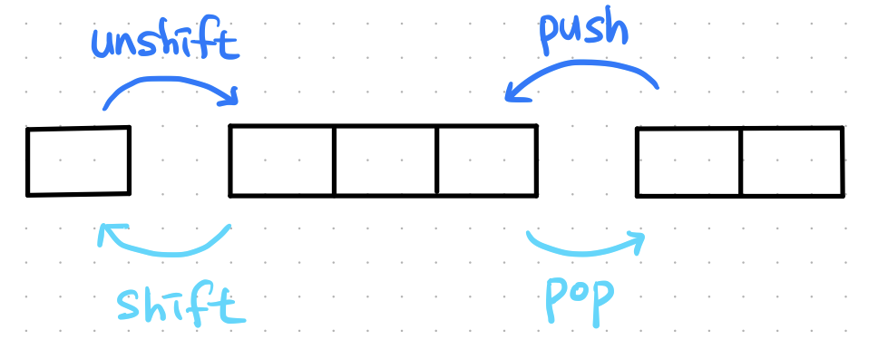
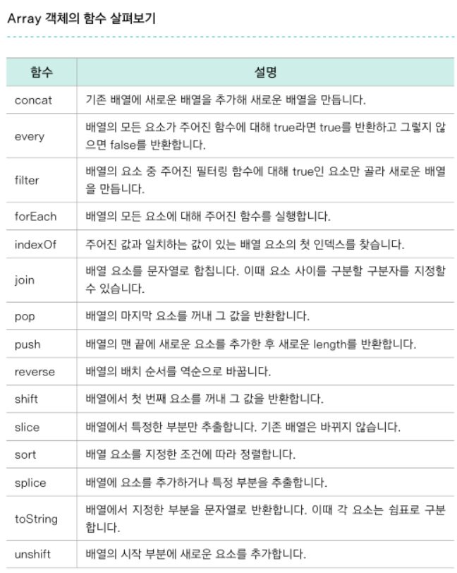
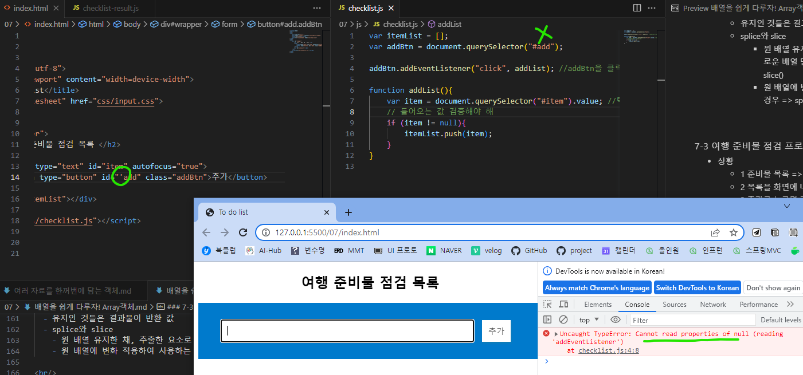
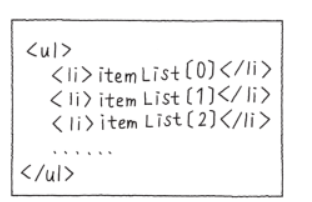
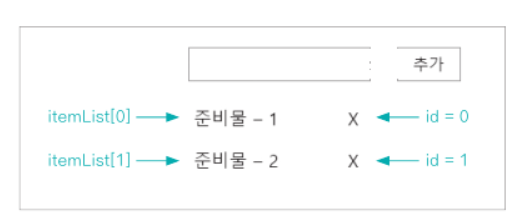

<br/>

### 7-1 Array 객체란?
- Array 객체로 배열 만들기
  ```
  var 변수명 = new Array();

  // 초기값이 있는 배열
  var numbers = ["one", "two", "Three", "four"];
  var numbers = new Array("one", "two", "Three", "four");
  ```
  - Array는 내장 객체
- 문법
  - 길이 : arr.length
  - i번 째 요소 : arr[ i ]
- 배열에 for문 사용
  - 배열의 요소를 점검할 때 사용
  ```
  for (var i = 0; i < seasons.length; i++){
    console.log(seasons[i]);
  }
  ```

<br/>
<br/>

### 7-2 Array 객체의 함수 알아보기
- concat()
  - 둘 이상의 배열 연결
  - ```
    기존배열.concat(연결할 배열);
    // 결과
    [ 기존배열 요소 먼저, 연결할 배열 요소 나중에 ]
    ```
- join()
  - 배열 요소를 연결
  - ```
    배열.join() // 구분기호 기본값은 (,)   
    배열.join("구분기호")    
    ```
- push(), pop(), unshift(), shift()
- push()
  - 배열 맨 끝에 요소 추가
  - ```
    var nums = ["1", "2", "3"]
    nums.push("4", "5")
    ==========================
    반환 => 5
    nums => ["1", "2", "3", "4", "5"]
    ```
- unshift()
  - 배열 맨 앞애 요소 추가
  - ```
    var nums = ["1", "2", "3"]
    nums.unshift("0")
    ==========================
    반환 => 4
    nums => ["0", "1", "2", "3"]
    ```
- pop()
  - 배열 맨 끝 요소 추출
  - ```
    var study = ["html", "css", "javascript"]
    study.pop()
    ==========================
    반환 => "javascript"
    study => ["html", "css"]
    ```
- shift()
  - 배열 맨 앞 요소 추출
  - ```
    var study = ["html", "css", "javascript"]
    study.shift()
    ==========================
    반환 => "html"
    study => ["css", "javascript"]
    ```
- splice()
  - 원하는 위치에 요소 추가, 삭제
  - ```
    // 인덱스 i부터 끝까지 삭제
    splice(i)

    // 인덱스 i부터 n개 삭제
    splice(i, n)

    // 인덱스 i부터 n개 삭제 후 요소 추가
    splice(i, n, 추가할 요소)

    // 인덱스 i에 요소 추가 (삭제 없는 경우이므로 n=0)
    splice(i, 0, 추가할 요소)
    

    // 인수 1개
    var numbers = [0, 1, 2, 3, 4, 5]
    numbers.splice(2)
    ==========================
    반환 => [2, 3, 4, 5]   // 삭제한 요소 반환 
    numbers => [0, 1]      // 삭제된 결과 반영

    // 인수 2개
    var numbers = [0, 1, 2, 3, 4, 5]
    numbers.splice(2, 2)
    ==========================
    반환 => [2, 3]
    numbers => [0, 1, 4, 5]

    // 인수 3개
    var numbers = [0, 1, 2, 3, 4, 5]
    numbers.splice(2, 3, 6)
    ==========================
    반환 => [2, 3, 4]
    numbers => [0, 1, 6, 5]

    // 인수 3개 : 삭제 없이 7,8 추가
    var numbers = [0, 1, 2, 3, 4, 5]
    numbers.splice(2, 0, 7, 8)
    ==========================
    반환 => []
    numbers => [0, 1, 7, 8, 2, 3, 4, 5]
    ```
- slice()
  - 원하는 위치의 요소 추출
  - ```
    // 인덱스 i부터 끝까지 추출
    slice(i)

    // 인덱스 i부터 인덱스 j 직전까지 추출
    splice(i, j)

    // 인수 1개
    var numbers = [0, 1, 2, 3, 4, 5]
    numbers.slice(2)
    ==========================
    반환 => [2, 3, 4, 5]           // 추출한 요소 반환
    numbers => [0, 1, 2, 3, 4, 5]  // 원래 배열 유지

    // 인수 2개
    var numbers = [0, 1, 2, 3, 4, 5]
    numbers.splice(2, 4)
    ==========================
    반환 => [2, 3, 4]
    numbers => [0, 1, 2, 3, 4, 5]

    ```
- 
- 배열의 함수 사용 시 주의점
  -  1 기존 배열 유지하는가 결과를 반영한 배열로 변화하는가
  -  2 반환 값은 무엇인지
  - |함수|기존배열 유지/변화|반환값|
    |:---:|:---:|:---:|
    |concat|유지|합친 새 배열|
    |join|유지|요소 연결한 String|
    |push|변화|length|
    |unshift|변화|length|
    |pop|변화|추출한 요소|
    |shift|변화|추출한 요소|
    |splice|변화|삭제한 요소|
    |slice|유지|추출한 요소|
  - 변화인 것들은 결과물이 기존 배열에 반영
  - 유지인 것들은 결과물이 반환 값
  - slice만 유지네..
  - splice와 slice
    - 원 배열 유지한 채, 추출한 요소로 새로운 배열 만들어 사용하는 경우 => slice()
    - 원 배열에 변화 적용하여 사용하는 경우 => splice()

<br/>
<br/>

### 7-3 여행 준비물 점검 프로그램 만들기
- 상황
  - 1 준비물 목록 => Array
  - 2 목록을 화면에 나열 => for
  - 3 추가를 누르면 준비물이 목록에 맨 뒤에 추가됨 => push
  - 4 각 준비물에 x 버튼을 누르면 목록에서 삭제됨 => splice
- index.html, checklist.js
- 버튼.addEventListener("click", addList)는 버튼.onclick = addList;와 같음
  - 클릭이 들어오면, addList 함수를 실행하라
  - id값에 오타가 나니 Uncaught TypeError: Cannot read properties of null (reading 'addEventListener') 에러가 뜸 
  - focus() 함수 : 해당 요소에 포커스를 주는 함수. 텍스트 필드 안에 커서를 갖다 놓음
  - 목록 나열 
  - 삭제 버튼의 id를 배열의 index로 맞추기
  - querySelectorAll() : 괄호 안에 지정된 이름을 가진 모든 요소 가져옴
  - this 키워드 사용해서 이벤트가 발생한 요소 알아낼 수 있음
  - 복습할 때 실행경로 구조화 해보기 (안 보고)

<br/>
<br/>

- Quiz 2
  - 난수 생성 관련 참고 블로그 https://hianna.tistory.com/454
  - n <= ramdom <= m 사이의 정수 생성
    - Math.floor(Math.random() * (m-n+1)) + n
  - \&quot; : 따옴표 충돌 문제 시 사용
    - 태그 내부의, 쌍따옴표로 둘러싸인 곳 안에서 다시 쌍따옴표를 사용할 때
