<br/>

### 8-1 문서 객체 모델(DOM) 이란?
- 돔 DOM (Document Object Model 문서 객체 모델)
  - 정의 : (웹 문서의 모든 요소를 자바스크립트를 이용하여 조작할 수 있도록) 객체를 사용해 문서를 해석하는 방법
  - 즉, 웹 문서의 텍스트, 이미지, 표 등등의 모든 요소 => 객체
- document : 웹 문서 자체를 가리키는 객체 ( ∈ DOM )
  - 웹 문서의 소스를 전부 담고 있음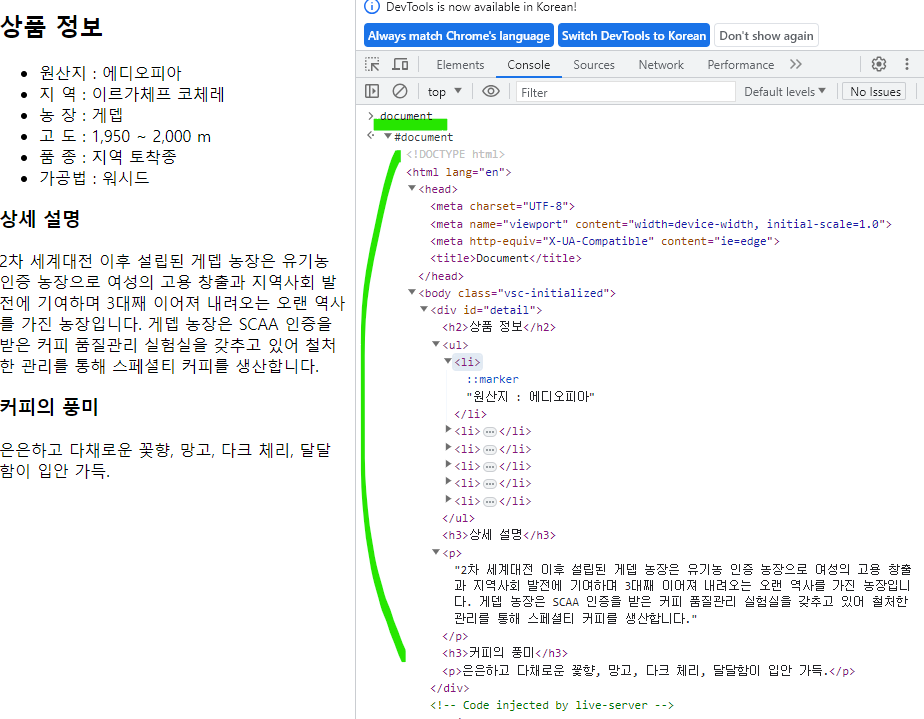
- DOM 트리
  - 부모요소, 자식요소로 계층 구조 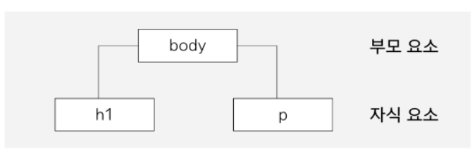
  - 노드(Node) : 웹 문서의 요소나 속성. 요소가 품고 있는 텍스트, 이미지도 모두 노드 
  - 가지 : 노드와 노드 사이의 연결 관계
  - 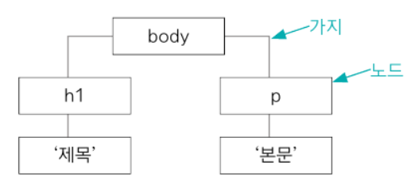
    - 태그 : 요소(Element) 노드
    - 태그가 품고 있는 텍스트 : 텍스트(Text) 노드
    - 태그의 속성 : 속성(Attribute) 노드
    - 주석 : 주석(Comment) 노드
  - 최상위 노드 : 루트 노드 (html이겠지)
- DOM 트리 확인할 수 있는 사이트 : https://software.hixie.ch/utilities/js/live-dom-viewer/
  - 태그는 보라색, #text:는 텍스트 노드, 값이 없는 건 줄 바꿈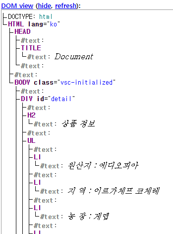

<br/>
<br/>

### 8-2 DOM **요소**에 접근하기
- CSS의 선택자(Selector)를 사용해서 접근
- getElementById()
  - id 선택자로 접근
- getElementsByClassName()
  - 엘리멘"츠" s가 붙은 것 확인 => HTMLCollection 객체 반환
    - HTMLCollection : 여러 개의 HTML요소를 담고 있는(Collection)자료 형식. 배열과 비슷
    - 인덱스 사용해서 특정 요소에 접근
  - 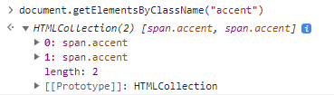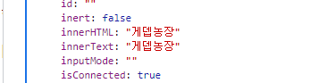
- getElementsByTagName()
  - id, class 선택자가 없을 땐 위의 방법 못 씀
  - 태그 이름을 찾아 DOM 요소에 접근
  - 엘리멘"츠" s가 붙은 것 확인 => HTMLCollection 객체 반환
- querySelector(), querySelectorAll()
  - id(#), class(.), 태그 이름 모두 사용 가능
  - 여러 요소 가능한 class, 태그 이름에 querySelector() 사용 => 첫 번째 요소에만 접근
  - querySelectorAll() => NodeList 반환 (HTMLCollection와 똑같이 사용하면 돼)
  - 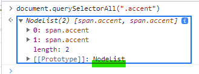
- getElementById() 와 querySelector()의 차이 : querySelector()는 둘 이상의 선택자 사용 가능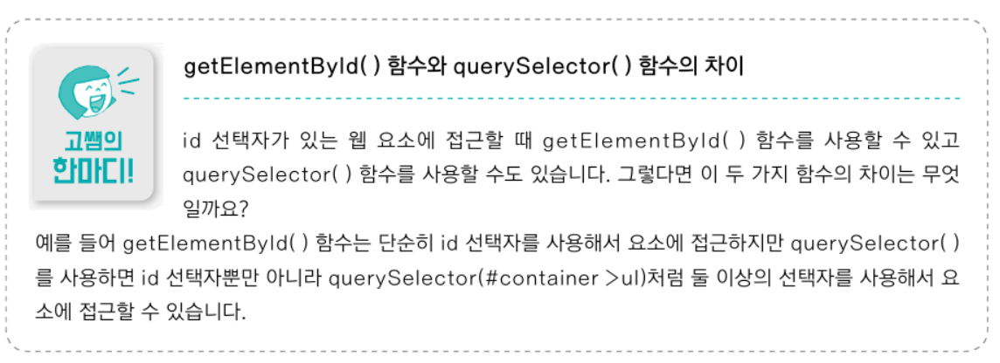
  - 인덱스로는 한계 있을 때, 자식선택자(>) 사용하면 좋아 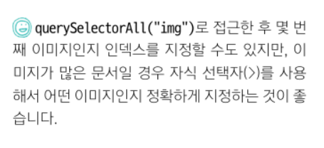
<br/>
<br/>

### 8-3 DOM 요소의 **속성**에 접근하기
- 속성 노드에 접근하면 HTML 요소의 속성 값을 원하는 값으로 수정 가능
- getAttribute(), setAttribute()
  - getAttribute(속성) : 속성에 접근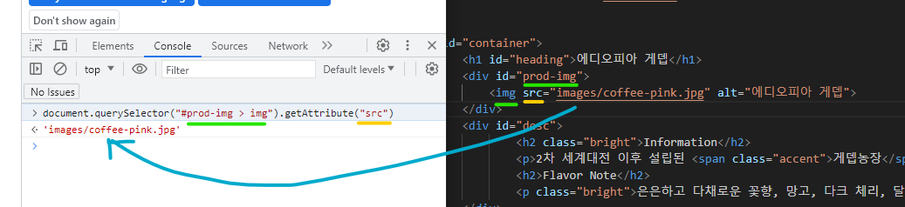
  - setAttribute(속성, 값) : 접근한 속성의 값 바꾸기
    - 없다면 새로 추가되고, 있다면 수정됨
- setAttribute() 함수 대신, 속성 상용 가능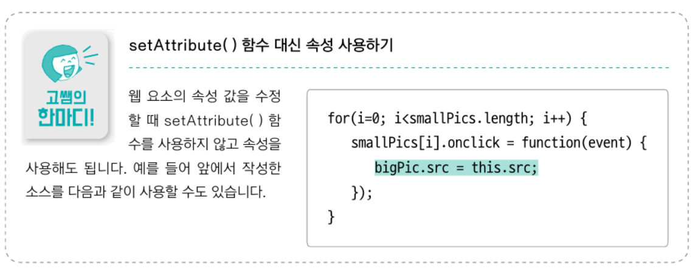
- 실습 상황 : 선택한 이미지 표시하기
  - showBig.html, showBig.js
  - 내가 수정하려는 id, class, 태그 이름 등을 확인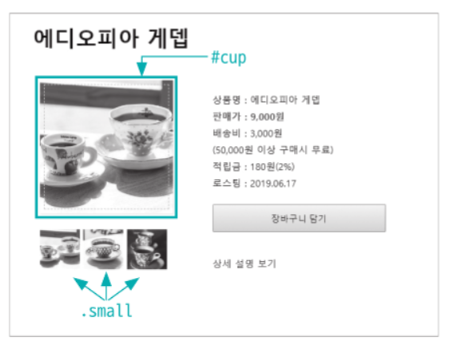
  - 로직 생각하기
    - 작은 사진에 onclick 속성 추가
    - onclick에 걸린 함수는 showBig
    - showBig은 큰 사진의 src 요소의 값을 (클릭한) 작은 사진의 src요소의 값으로 수정
  - 작은 사진 여러 개 => for문 돌면서 onclick 붙이기

<br/>
<br/>

### 8-4 DOM에서 이벤트 처리하기
- 5장에서 학습했던 이벤트 처리기
  - HTML 태그 안에서 이벤트 처리기 연결 => 단점 많아서 잘 사용 x
    - 하나의 요소에 하나의 이벤트 처리기만 사용 가능
    - 중간에 이벤트나 연결 함수를 바꾸려면 HTML 소스를 수정해야 함
  - DOM 요소에 이벤트 처리기 연결
    - 요소를 스크립트로 가져와 변수에 저장한 후 ".onㅇㅇㅇ = 함수" 로 사용
- addEventListener()
  - 이벤트가 발생한 요소에 이벤트 처리기를 연결해 주는 함수
  - 한 요소에 여러 이벤트 동시에 처리 가능
  - 특정 요소 뿐만 아니라 Document객체, Window객체 등 어디서든 사용 가능
  - ```
    // 가져온 웹 요소를 변수에 담고
    변수.addEventListener(이벤트 유형, 함수, 캡쳐 여부)
    ```
    - 처리할 이벤트 유형 : 예) "click", "mouseover"
    - 함수 : 이벤트가 발생했을 때 실행할 명령, 함수
    - 캡쳐 여부 : 이벤트를 캡처링하는지 여부를 지정 가능
      - false 버블링 : 기본값. 즉, 생략하면 false
      - true 캡처링
      - 이벤트 캡처링 : DOM의 부모 노드에서 자식 노드로 이벤트가 전달되는 것
      - 이벤트 버블링 : DOM의 자식 노드에서 부모 노드로 이벤트가 전달되는 것
      - 이 책에서는 다루지 x
      - 참고 : https://velog.io/@tlatjdgh3778/이벤트-버블링과-캡처링에-대한-정리

<br/>
<br/>

### 8-5 웹 요소 내용과 스타일 가져와서 수정하기
- DOM으로 CSS 속성에 접근, 수정
  - 스타일 속성에 접근 : .style.CSS속성
  - 하이픈(-)이 포함된 속성은 낙타기법으로 표기 : 예) backgroundColor, borderRadius
  - 화면에 표시/감추기 속성
    - display: block : 화면에 표시
    - display: none : 화면에서 감추고, 그 요소가 차지하던 공간도 사라짐
    - visibility:hidden : 화면에서 감추고, 요소가 있던 공간을 빈 상태로 남김
    - 예) 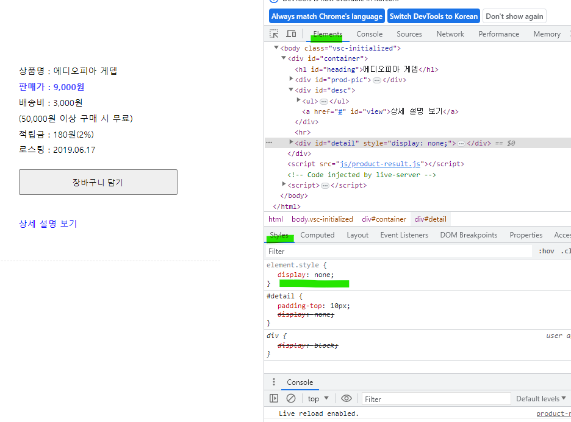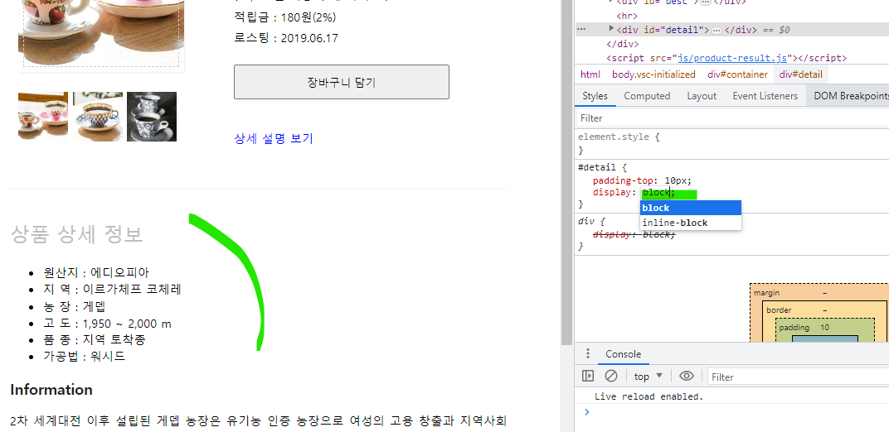
- **실습 : 상품 상세설명 화면 표시/감추기** (토글 사용하는 논법 잘 알아두자!!)
  - product.html, product.js
  - 이벤트 처리기를 달 요소, 실제 결과를 반영할 요소 확인
    - [상세 설명 보기]에 클릭 이벤트를 달 거임 => id="view"
    - [상품 상세 정보]가 보일 거임 => id="detail"
    - 즉, "#view"요소를 누르면 "#detail"요소가 화면에 나타나는 코드
  - 클릭이벤트가 토글로 적용되어야 함
    - 불리언 변수 isOpen을 사용해서 조건문으로 관리
    - 변수 선언 소스끼리 모아 두는 것이 가독성 좋으므로 맨 위에 선언
  - Q. 내가 혼자 만들어 볼 때는 textContent 사용했는데 솔루션은 innerText 사용함. 차이는?
    - 출처 : https://hianna.tistory.com/483
    - innerText : 사용자에게 보여지는 텍스트 값을 읽어옴
    - textContent : 해당 노드가 가지고 있는 텍스트 값 그대로를 읽어옴
 
<br/>
<br/>

### 8-6 DOM에 요소 추가하기
- 8-5에서는 이미 만들어져 있던 내용을 화면에서 표시/감춤. 지금은 요소 새로 표시
- 어떤 노드를 DOM트리에 추가할 건지 확인한 뒤 부모 노드에 연결해서 웹 문서에 추가/수정
  - 추가할 소스코드의 노드 파악
    - 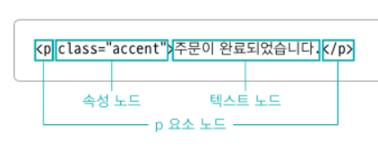
  - 요소 노드 생성 -> 내부의 텍스트, 속성 등의 새로운 노드 생성 & 각각 바로 자식 노드로 추가 -> 요소 노드를 부모 노드에 추가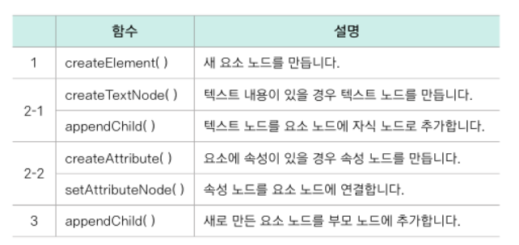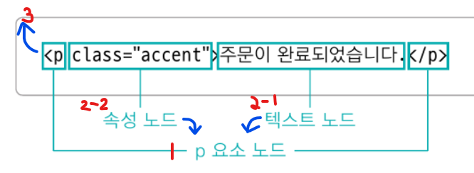
- 순서대로 실제로 코드 작성해보자. (이 때, 2-2와 3 순서 바꿈)
  - createElement("태그") : 요소 노드 만들기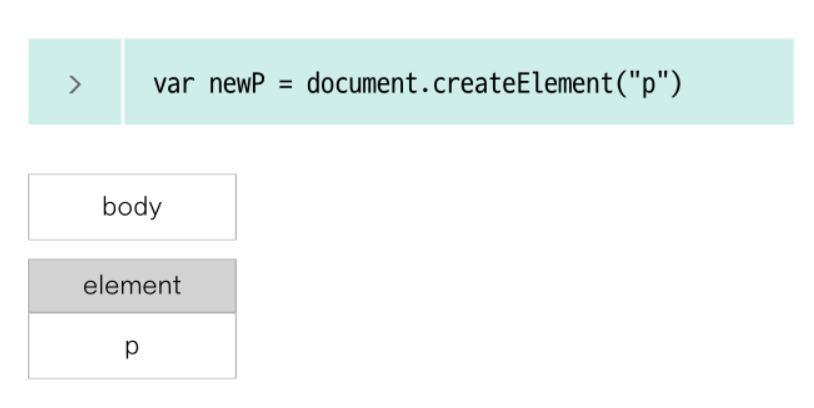
  - createTextNode("텍스트") : 텍스트 노드 만들기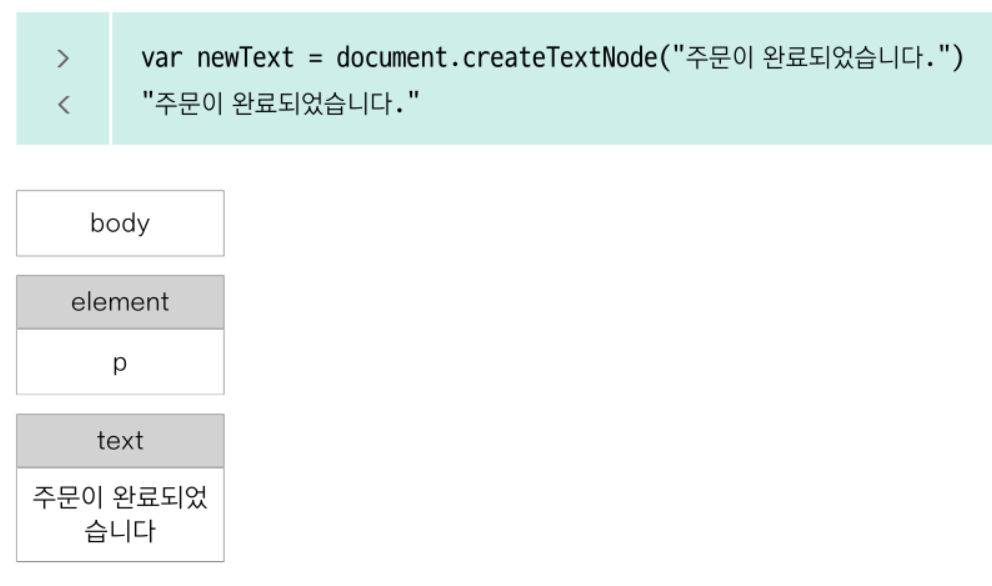
  - 부모노드.appendChild(자식노드) : 텍스트/요소 노드를 요소 노드의 자식 노드로 연결!
    - 텍스트 노드를 요소 노드에 연결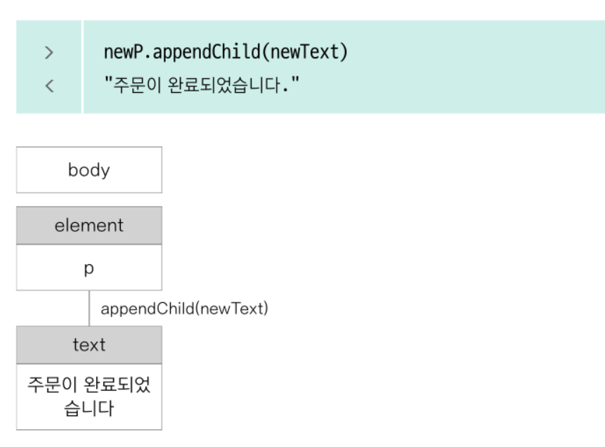
    - 요소 노드를 body에 연결
      - body는 document.body로 찾아갈 수 있음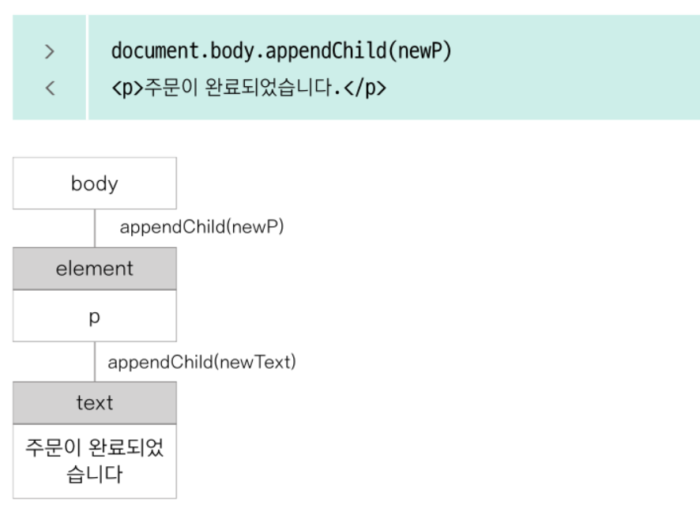
  - createAttribute("속성") : 속성 노드 만들기
    - 노드.value = "값" : 구체적인 값 추가 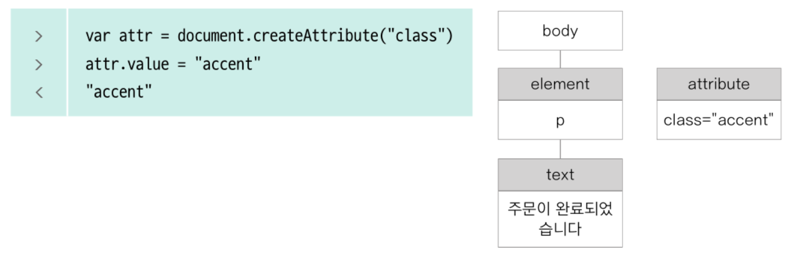
  - 요소노드.setAttribute**Node**(속성노드) : 속성노드를 요소 노드에 연결 (반환값은 null)
    - Node 까먹지 말기! 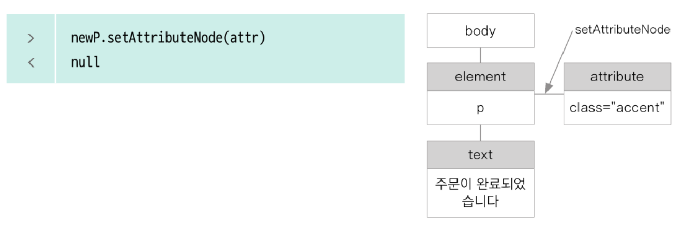
    - 그냥 setAttribute는?
      - 요소노드.setAttribute(속성노드, 값)
      - 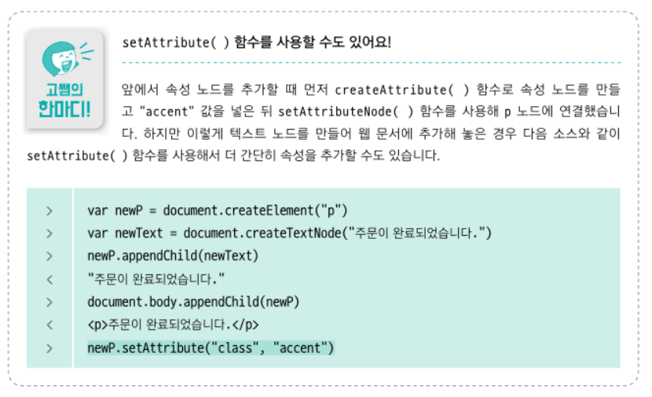
- 실습 : 참가 신청 명단 프로그램 만들기
  - 7장에서는 같은 문제를 배열 이용해서 해결했었음 -> 이제, DOM의 노드를 이용해서 만들어보자.
  - 책은 register-create.html, register-create.js
  - 나는 register.html, register.js에 만듦
  - 나는 버튼을 스크립트로 가져와서 addEventListener 사용했는데, 책은 html에서 온클릭 으로 이벤트 함수 지정
    - 그 때, return false; 추가 (그렇지 않으면 버튼 눌렀을 때 빈 페이지로 넘어간대..)
  - DOM 구조를 그려보고 -> 추가하려는 노드들 파악 -> 생성 & 연결
 
<br/>
<br/>

### 8-7 추가한 노드 순서 바꾸거나 삭제하기
- querySelectorAll은 nodeList 객체 반환
  - n번째 노드 : 인덱스 n-1
  - 노드 개수 : length 속성
- hasChildNodes() 함수
  - 자식 노드 확인
  - 있다면 true, 없다면 false 반환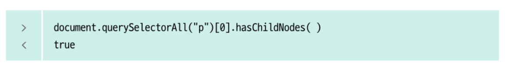
- childNodes 속성
  - (모든) 자식 노드에 접근
  - 요소 노드뿐만 아니라 태그와 태그 사이의 줄바꿈도 빈 텍스트 노드인 자식 노드로 인식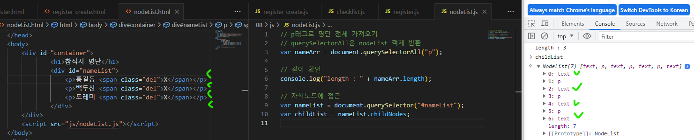
- children 속성
  - 자식 노드 중 요소 노드에만 접근
  - 텍스트 노드 ,주석 노드 접근 x
- insertBefore() 함수
  - 원하는 위치에 노드 삽입
  - 부모노드.insertBefore(추가할 노드, 기준 노드) : 기준 노드 앞에 추가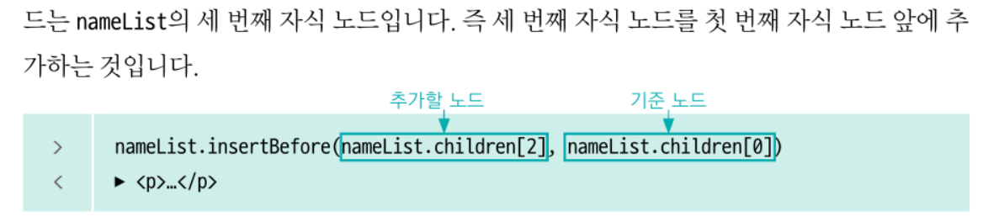
  - appendChild() 함수는 맨 뒤에 추가했었어 (즉, appendChild()함수 대신 사용하는 함수임)
- 그래서 원하는 위치에 노드를 추가할 때는 : 부모노드.children 속성으로 자식노드들 목록을 찾고 -> 부모노드.insertBefore(추가할 노드, 기준 노드)로 원하는 위치에 추가
- removeChild() 함수
  - 부모 노드에서 자식 노드를 삭제
  - 부모노드.removeChild(자식 노드)
  - 노드는 스스로 자신을 삭제할 수 없음 => 부모 노드에 접근해서 자식노드를 삭제해야 함
- parentNode 속성
  - 현재 노드의 부모 요소 노드 찾기
- 그래서 요소를 삭제할 때는 : 해당요소.parentNode로 부모요소를 찾고 -> 부모요소.removeChild(해당요소)로 요소 삭제
- 실습
  - 8-6의 register.html, register.js에 기능을 추가해보자.
  - 실습 1 : 명단의 맨 위에 추가하기
    - appendChild() 대신 insertBefore() 사용
    - 부모요소.insertBefore(추가할 노드, 부모요소.children[0])
  - 실습 2 : 요소 삭제하기
    - 삭제 버튼 만들기 : 요소 생성 & 연결
    - 버튼에 이벤트 리스너 달기 : 버튼.addEventListener(클릭, 삭제하는 함수)
    - 삭제하는 함수 만들 때 주의할 점
      - 삭제하려는 것이 뭔지 잘 체크하고, 정확히 찾아가기
      - 여기서는, 버튼을 삭제하는 게 아니라 버튼이 들어있는 p태그를 삭제하는 것 이므로
      - 삭제버튼(c)의 부모(b)의 부모(a)를 찾아가서 부모(b)를 삭제해야 함
        - 즉, this.parentNode.parentNode.removeChild(this.parentNode);
    - 참고 : 답안에서는 this.parentNode.parentNode가 있는지 검증했어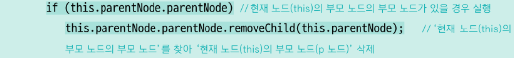
      - 근데 내 생각에는... 지금 상황에서는 필요 없는 것 같아..
      - 처음부터 \[추가]버튼을 클릭 했을 때 -> p태그 생성&부모에연결, span태그 생성&부모에연결
      - 이게 동시에 일어나니까 할머니가 없을 수 없는거지
      - 하지만 검증 논법은 상황에 따라 필요하니까 알아두자!!

<br/>
<br/>


