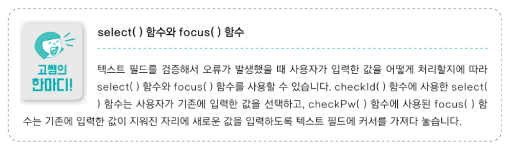
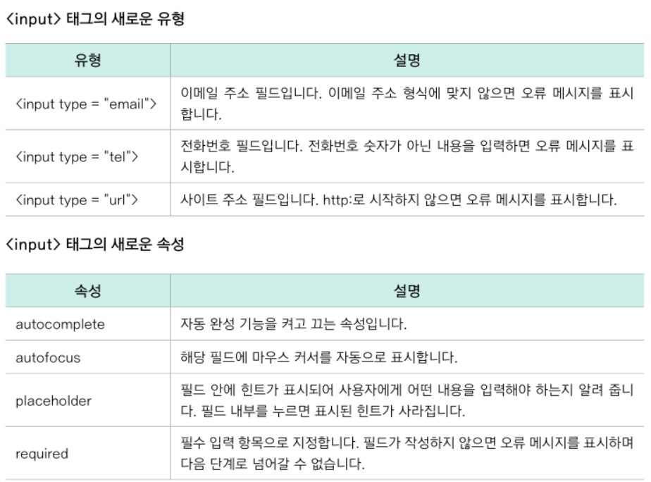

<br/>

- 폼(Form) : 사용자가 정보를 입력할 수 있게 만들어 놓은 웹 요소
  - 예) 아이디, 비밀번호 입력. 주소지, 전화변호 입력
  - 사용자가 폼 요소에 입력한 내용을 가져오기, 수정하기, 형식에 맞는지 확인하기 => 자바스크립트로 처리

<br/>
<br/>

### 9-1 폼 요소에 접근하는 여러 가지 방법
- id, class 값으로 접근
  - queryselector
  - 텍스트 필드의 값 가져오기 : .value
- name 값으로 접근
  - id, class 속성은 CSS를 사용하면서 등장했지만
  - name 속성은 자바스크립트에서 폼 요소를 구별하고 접근할 수 있도록 HTML 초기부터 사용하던 방법
  - 폼 요소에서 사용하는 name값은 주로 id값과 같게 지정
  - 폼의 name값, 폼 요소의 name값까지 계층을 따라 지정
    ```
    // 방법1
    document.폼의name값.폼요소의name값

    // 방법2
    documnent.forms["폼의name값"].elements["폼요소의name값"]
    ```
  - 텍스트 필드의 값 가져오기 : .value
- 폼 배열로 접근 (실무에서는 사용도 낮음)
  - 폼 요소에 id, class, name 속성이 없을 때 사용
  - document의 속성 중 forms 속성
    ```
    // i번째 폼의 j번째 요소
    document.forms[i].elements[j].value
    ```
- 실습 : 폼 요소에 입력한 내용을 다른 폼 요소로 복사
  - [X] 주문 정보와 배송 정보가 같습니다. 체크박스 클릭 시, 함수가 실행되도록 이벤트 처리
    - check 객체의 checked 속성 : 체크됐을 때 true
  - 체크 시 값 복사, 해제 시 폼 요소 비우기

<br/>
<br/>

### 9-2 폼 요소에서 입력값 검증하기
- 폼 밸리데이션 (Form Validation, 입력값 검증)
  - 값이 입력되었는지
  - 입력된 값이 정해진 조건에 맞는지 등
- change 이벤트
  - 목록이나 체크 상태 등이 변경되었을 때 이벤트 발생
  - \<input>, \<select>, \<textarea> 태그에서 사용
  - 텍스트 필드에 입력을 마치고 그 필드를 빠져나올 때 발생
- .length : 값의 길이
- select() 함수, focus() 함수
  - select() 함수 : 텍스트 필드에 입력한 내용을 선택 (드래그)
  - focus() 함수 : 해당 택스트 필드로 커서 이동
  - 
- 실습
  - 아이디 : 글자 수 확인
  - 비번 : 두 개 필드 내용이 서로 같은지 확인
  - 영문, 숫자만 사용됐는지 확인하는 건 정규 표현식 => 이 책에서는 다루지 않겠음
- 태그 자체에서 폼 검증하기
  - HTML5 \<input>태그에 폼 검증을 위한 여러 속성 有 

<br/>
<br/>

### 9-3 다양한 폼 요소 다루기
- 9-1, 9-2는 텍스트 필드에 대한 폼 요소를 다뤘었음
- 9-3에서는 다른 폼 요소 : 선택 목록(\<select>, \<option>), 라디오 버튼 (\<input type="radio">), 체크 상자 (\<input type="checkbox">)
- 선택 목록
  - 선택 목록에 접근하면 선택 목록의 옵션 항목이 배열 형태로 저장 : HTMLOptionCollection 객체
    ```
    // options 속성 사용하여 option 항목에 접근
    document.폼의name값.선택목록의name값.options

    // i번째 옵션이 화면에 표시하는 내용 : innerText
    document.폼의name값.선택목록의name값.options[i].innerText

    // i번째 옵션 선택 시 서버에 넘어가는 값 : value
    document.폼의name값.선택목록의name값.options[i].value
    ```
  - selectedIndex : 사용자가 선택한 옵션의 인덱스 값 저장 (미선택 시 기본값 0)
    ```
    var 선택목록 = document.폼의name값.선택목록의name값;

    // 사용자가 선택한 옵션 항목 찾기
    선택목록.options[선택목록.selectedIndex]
    ```
- 라디오 버튼, 체크 상자
  - 라디오 버튼 : 여러 항목 중 하나만 선택 가능 => name값을 1개 사용 가능
  - 체크 상자 : 여러 개 선택 가능 => name값 서로 다름, 혹은 배열로 지정
  - ```
    // 라디오 버튼 (RadioNodeList 객체)
    document.폼의name값.라디오버튼의name값

    // 체크 상자
    document.폼의name값.체크상자의name값
    ```
  - 라디오 버튼에 접근하면 같은 name 값을 가진 요소가 배열 형태로 저장 : RadioNodeList 객체
    - value : 선택한 버튼의 value값 저장 (기본값 "")
- checked 속성 : 선택하면 true, 기본값 false
- 응용1 : 추가한 메뉴의 가격을 합계에서 더하거나 빼기
