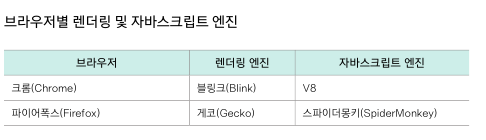
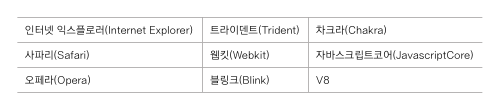

<br/>

### 10-1 브라우저 객체 모델이란?
- 브라우저 객체 모델 (Browser Object Model)
- '브라우저' 를 객체로 관리  

<br/>
<br/>

### 10-2 웹 브라우저를 제어하는 Window 객체
- Window 객체
  - 자바스크립트 객체 중 최상위이자 기본이 되는 객체
- Window 객체의 속성 
- Window 객체의 함수
  - Window 객체는 기본 객체이기 때문에 window.을 생략하고 함수만 입력 가능
  - open( ) 함수 : 새 창을 엶
    - 첫 번째 매개변수 : 오픈할 주소
    - 두 번째 매개변수 : 새 창의 타깃(Target)이나 윈도우 이름
      - "_self " : 현재 창에 새 창 표시
    - 세 번째 매개변수 : 알림창의 너비, 높이, 위치 등 빈 따옴표는 빈 문서
    - 빈 따옴표는 빈 문서
    ```
    // 예
    open("https://www.daum.net", "", "left=0, top=0, width=300, height=300")
    ```
  - resizeBy(), resizeTo() 함수
    - open() 함수로 열린 알림 창의 크기를 조절
    - resizeBy(w, h) : 현재 크기를 기준으로 너비와 높이에 값을 더해줌
    - resizeTo(w, h) : 최종 크기 지정
  - moveBy(), moveTo() 함수
    - 열려 있는 알림 창의 위치 조절
    - moveBy(x, y) : 현재 위치를 기준으로 가로로 x픽셀, 세로로 y픽셀 이동
    - moveTo(x, y) : 회면 왼쪽 위 모서리를 기준으로 이동
  - 함수 문법 검색 : developer.mozilla.org/docs/Web/API/Window#Methods
- 모달 창 (Modal Window)
  - 이벤트 정보나 공지 내용 등을 표시하기 위해 현재 브라우저 창 위에 띄우는 새로운 창
  - vs 알림 창 : 웹 브라우저 창을 새로 엶
  - 모달창은 문서 소스 안에 <\div> 태그를 사용해 삽입하고 레이어로 표시
  - 즉, 웹 브라우저에서 알림 창을 차단하더라도 모달 창은 화면에 표시 가능
- 실습 : 팝업 창 띄우기
  - 브라우저에서 팝업을 차단하면 whidow.open()은 null을 반환
  - 창 닫기 하이퍼링크 : <\a href="javascript:window.close();">창닫기<\/a>

<br/>
<br/>

### 10-3 브라우저 정보가 담긴 Navigator 객체
- Navigator 객체
  - 웹 브라우저와 관련된 정보들
  - 버전, 어떤 플러그인이 설치되어 있는지, 온(오프)라인 상태 등
  - 현재 웹 문서에 접속한 사용자가 어떤 브라우저를 사용했는지, 모바일로 접속했는지 등을 알 수 있게 해줌
  - 렌더링 엔진의 이름을 보고 웹 브라우저 종류를 구별
- 엔진
  - 
    - 주소창에 chrome://version/ 으로 확인 가능
    - 블링크 엔진은 웹킷 엔진을 기반으로 하고 있어서, '애플웹킷'으로 표시됨
  - 렌더링 엔진 (Rendering Engine)
    - 웹 문서를 화면에 표시하기 위해 웹 문서의 태그와 스타일을 해석하는 프로그램
    - 브라우저마다 내장된 렌더링 엔진이 다르기 때문에 HTML이나 CSS를 해석하는 방법이 다름
  - 자바스크립트 엔진
    - 자바스크립트 소스를 해석하는 엔진
    - 웹 브라우저마다 다름
- Navigator 객체의 속성
  - userAgent
    - 사용자 에이전트 문자열
      - 클라이언트에서 서버로 정보를 보낼 때 클라이언트에서 함께 보내는 정보
      - 서버에서 이 정보를 보고 -> 브라우저 버전, 종류를 확인한 후 -> 그 브라우저에 맞게 웹 페이지 표시
    - 
    - 크롬

<br/>
<br/>

### 10-4 그 밖의 브라우저 객체
- History 객체
  - 브라우저에서 '뒤로', '앞으로' 또는 주소 표시줄에 입력해서 돌아다녔던 사이트 주소가 저장되어 있음
- Location 객체
  - 현재 문서의 URL 주소 정보 → 이 정보를 편집하여 현재 브라우저 창에 열릴 사이트나 문서를 지정
  - 
- Scrren 객체
  - 사용자의 화면 정보를 알아낼 때 사용
  - Screen객체의 availWidth/availHeight, width/heigth 속성은 **화면 자체**의 너비나 높이를 측정
  - 
- Scrren 객체
  - 사용자의 화면 정보를 알아낼 때 사용
  - 기기의 화면 자체 (PC모니터, 모바일)
  - Screen객체의 availWidth/availHeight, width/heigth 속성은 **화면 자체**의 너비나 높이를 측정


